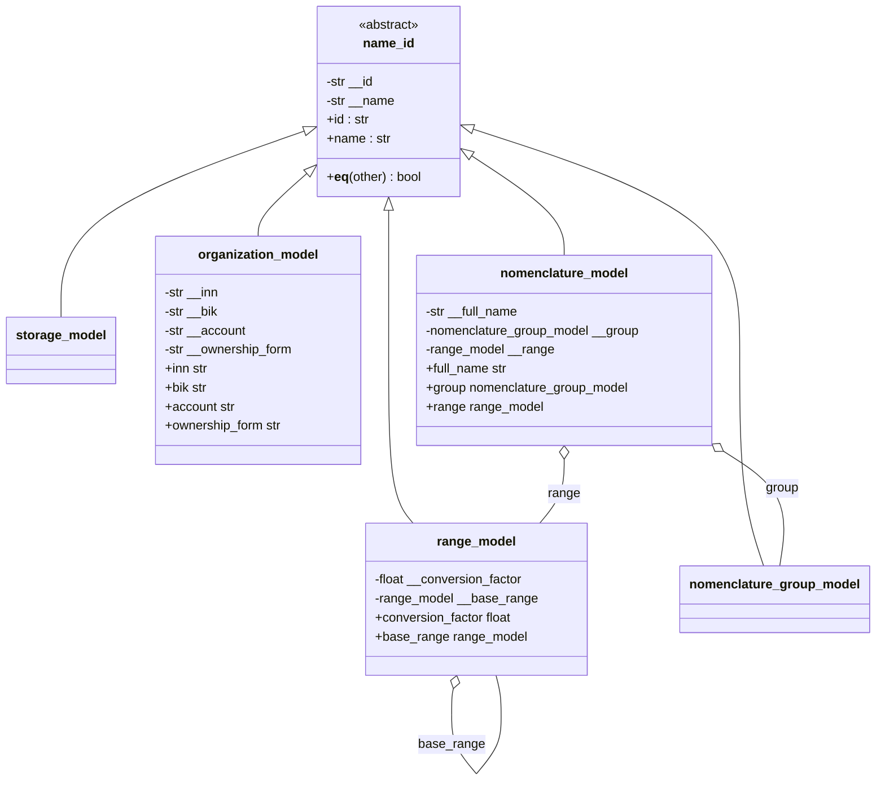

# Архитектура доменных моделей

```mermaid
classDiagram
    direction TB

    class name_id {
        <<abstract>>
        -str __id
        -str __name
        +id : str
        +name : str
        +__eq__(other) bool
    }

    class range_model {
        -float __conversion_factor
        -range_model __base_range
        +conversion_factor float
        +base_range range_model
    }

    class nomenclature_group_model {
    }

    class storage_model {
    }

    class organization_model {
        -str __inn
        -str __bik
        -str __account
        -str __ownership_form
        +inn str
        +bik str
        +account str
        +ownership_form str
    }

    class nomenclature_model {
        -str __full_name
        -nomenclature_group_model __group
        -range_model __range
        +full_name str
        +group nomenclature_group_model
        +range range_model
    }

    name_id <|-- range_model
    name_id <|-- nomenclature_group_model
    name_id <|-- storage_model
    name_id <|-- organization_model
    name_id <|-- nomenclature_model

    nomenclature_model o-- nomenclature_group_model : group
    nomenclature_model o-- range_model : range
    range_model o-- range_model : base_range
```
