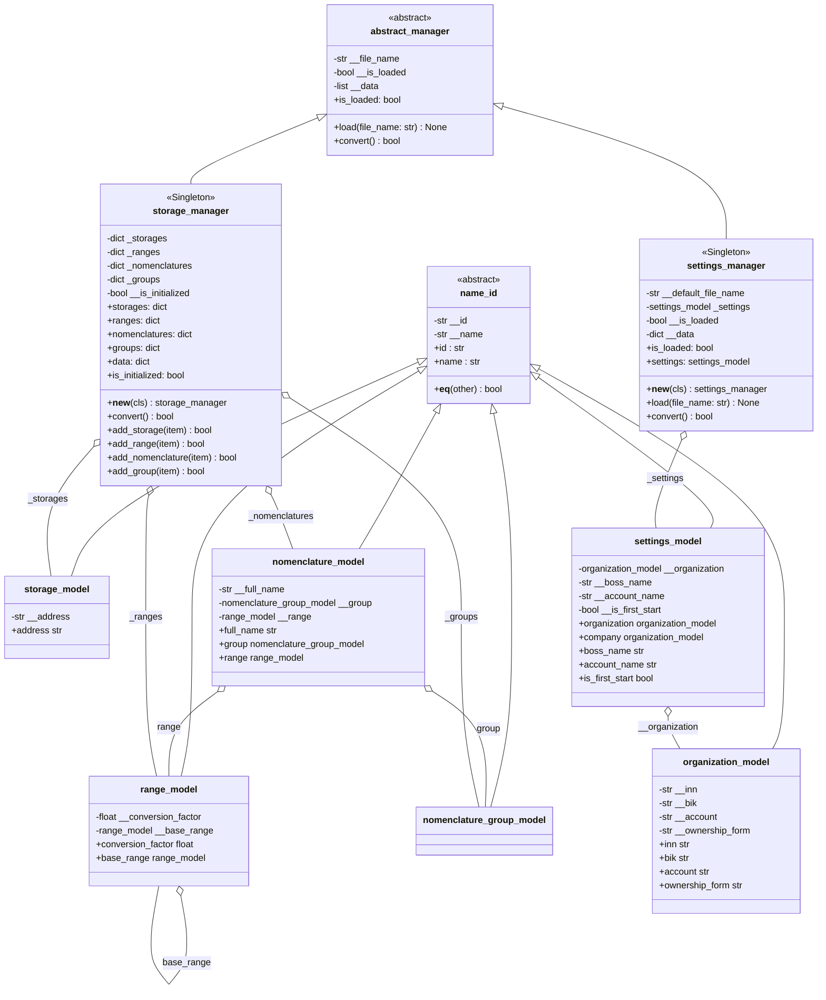

# Архитектура проекта

```mermaid
classDiagram
    direction TB

    class name_id {
        <<abstract>>
        -str __id
        -str __name
        +id : str
        +name : str
        +__eq__(other) bool
    }

    class range_model {
        -float __conversion_factor
        -range_model __base_range
        +conversion_factor float
        +base_range range_model
    }

    class nomenclature_group_model {
    }

    class storage_model {
        -str __address
        +address str
    }

    class organization_model {
        -str __inn
        -str __bik
        -str __account
        -str __ownership_form
        +inn str
        +bik str
        +account str
        +ownership_form str
    }

    class nomenclature_model {
        -str __full_name
        -nomenclature_group_model __group
        -range_model __range
        +full_name str
        +group nomenclature_group_model
        +range range_model
    }

    class settings_model {
        -organization_model __organization
        -str __boss_name
        -str __account_name
        -bool __is_first_start
        +organization organization_model
        +company organization_model
        +boss_name str
        +account_name str
        +is_first_start bool
    }

    class abstract_manager {
        <<abstract>>
        -str __file_name
        -bool __is_loaded
        -list __data
        +load(file_name: str) None
        +convert() bool
        +is_loaded: bool
    }

    class settings_manager {
        <<Singleton>>
        -str __default_file_name
        -settings_model _settings
        -bool __is_loaded
        -dict __data
        +__new__(cls) settings_manager
        +load(file_name: str) None
        +convert() bool
        +is_loaded: bool
        +settings: settings_model
    }

    class storage_manager {
        <<Singleton>>
        -dict _storages
        -dict _ranges
        -dict _nomenclatures
        -dict _groups
        -bool __is_initialized
        +__new__(cls) storage_manager
        +convert() bool
        +add_storage(item) bool
        +add_range(item) bool
        +add_nomenclature(item) bool
        +add_group(item) bool
        +storages: dict
        +ranges: dict
        +nomenclatures: dict
        +groups: dict
        +data: dict
        +is_initialized: bool
    }

    name_id <|-- range_model
    name_id <|-- nomenclature_group_model
    name_id <|-- storage_model
    name_id <|-- organization_model
    name_id <|-- nomenclature_model
    name_id <|-- settings_model

    abstract_manager <|-- settings_manager
    abstract_manager <|-- storage_manager

    nomenclature_model o-- nomenclature_group_model : group
    nomenclature_model o-- range_model : range
    range_model o-- range_model : base_range

    settings_manager o-- settings_model : _settings
    settings_model o-- organization_model : __organization

    storage_manager o-- storage_model : _storages
    storage_manager o-- range_model : _ranges
    storage_manager o-- nomenclature_group_model : _groups
    storage_manager o-- nomenclature_model : _nomenclatures
```
