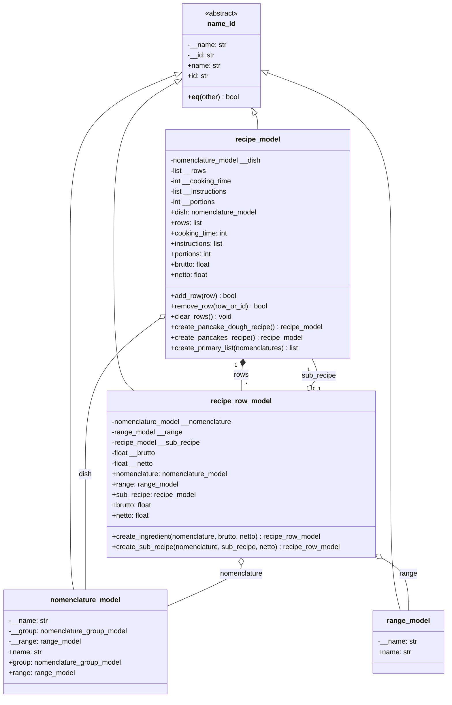

# UML-диаграмма: recipe_model и recipe_row_model

## Описание доменной модели

### 1. Сущности
* **`recipe_model`** — технологическая карта блюда или полуфабриката. Содержит наименование блюда (`dish`), список строк (`rows`), время приготовления (`cooking_time`), инструкцию (`instructions`) и количество порций (`portions`).
* **`recipe_row_model`** — строка технологической карты. Описывает использование ингредиента (`nomenclature`) или полуфабриката (`sub_recipe`).

### 2. Паттерны и связи
* **Композиция (`recipe_model *-- recipe_row_model`):** строки рецепта принадлежат конкретной технологической карте и не существуют отдельно от нее.
* **Рекурсивная агрегация (`recipe_row_model o-- recipe_model`):** строка может ссылаться на другую технологическую карту (`sub_recipe`), что позволяет строить иерархические рецепты с полуфабрикатами произвольной глубины.
* **Фабричные методы (Factory Method):** инкапсулируют создание строк (`create_ingredient`, `create_sub_recipe`) и готовых технологических карт (`create_pancake_dough_recipe`, `create_pancakes_recipe`, `create_primary_list`).

### 3. Расчет массы (на 1 порцию)
* Массы `brutto` и `netto` в `recipe_model` вычисляются динамически суммированием строк.
* Для полуфабрикатов масса `brutto` рассчитывается рекурсивно из `sub_recipe.brutto`.
