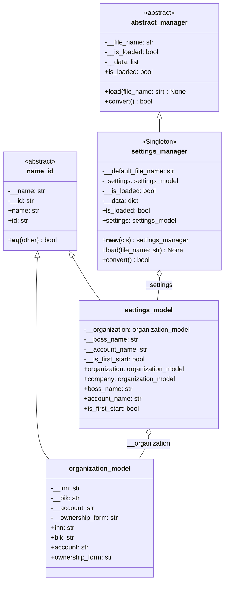

# UML-диаграмма: settings_manager

```mermaid
classDiagram
    direction TB

    class abstract_manager {
        <<abstract>>
        -__file_name: str
        -__is_loaded: bool
        -__data: list
        +load(file_name: str) None
        +convert() bool
        +is_loaded: bool
    }

    class settings_manager {
        <<Singleton>>
        -__default_file_name: str
        -_settings: settings_model
        -__is_loaded: bool
        -__data: dict
        +__new__(cls) settings_manager
        +load(file_name: str) None
        +convert() bool
        +is_loaded: bool
        +settings: settings_model
    }

    class settings_model {
        -__organization: organization_model
        -__boss_name: str
        -__account_name: str
        -__is_first_start: bool
        +organization: organization_model
        +company: organization_model
        +boss_name: str
        +account_name: str
        +is_first_start: bool
    }

    class organization_model {
        -__inn: str
        -__bik: str
        -__account: str
        -__ownership_form: str
        +inn: str
        +bik: str
        +account: str
        +ownership_form: str
    }

    class name_id {
        <<abstract>>
        -__name: str
        -__id: str
        +name: str
        +id: str
        +__eq__(other) bool
    }

    name_id <|-- settings_model
    name_id <|-- organization_model
    abstract_manager <|-- settings_manager

    settings_manager o-- settings_model : _settings
    settings_model o-- organization_model : __organization
```
